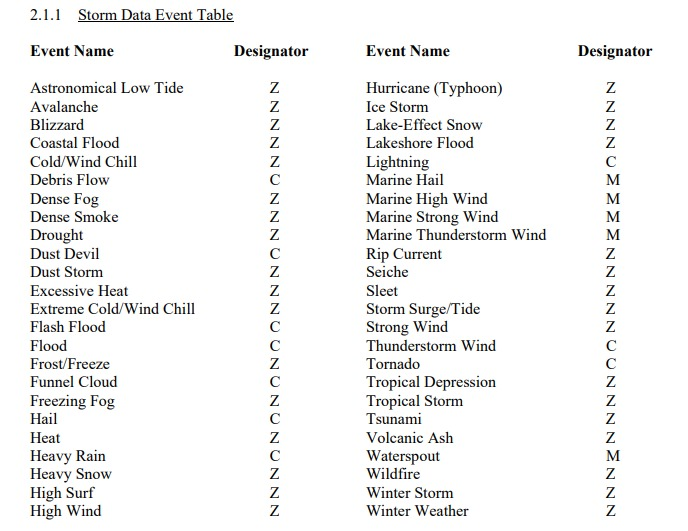

## Introduction/ Synopsis

The basic goal of this analysis is to explore the NOAA Storm Database and answer the following questions about severe weather events:
    
1. Across the United States, which types of events are most harmful with respect to population health?
    
2. Across the United States, which types of events have the greatest economic consequences?

Answering those questions may support preparations for severe weather events, e.g. by prioritizing resources for events likely to cause most population harm and/ or economic damage.

The rest of the report is organised as follows:

- *Dataset* section introduces the data and background information for the analysis,
- *Data Preview & Initial Processing* section includes some basic data processing steps to manage the variety of weather event types, 
- *Further Data Processing: Event Types* section includes further processing steps of weather event types, and establishes mapping to an established event taxonomy,
- *Analysis* section produces the basic analysis of weather events and impact on population and economy,
- *Results* section provides answers to the above questions, with illustrations,
- *Concluding Remarks* section summarises the analysis with suggestions for further analysis.

## Dataset

The analysis is done in R version 4.1.2 (2021-11-01), Platform: x86_64-w64-mingw32/x64 (64-bit), Running under: Windows 10 x64 (build 19045).

```{r sessioninfo, echo=TRUE, cache=TRUE} 
sessionInfo()
```

It is based on the dataset downloaded from the url below: 

```{r downloadreaddata, echo=TRUE, cache=TRUE} 
## dir.create("data") 
## fileUrl = "https://d396qusza40orc.cloudfront.net/repdata%2Fdata%2FStormData.csv.bz2"
## download.file(fileUrl,destfile="./data/StormData.csv.bz2",method="curl") 
stormdata <- read.csv("./data/StormData.csv.bz2")
```

The download part of the code is commented out as it only needs to be executed once. Data is cached due to its size, as it would be otherwise inefficient to handle.

Additionally, the analysis will reference the supporting documentation provided along with the dataset:

- "STORM DATA PREPARATION" source file: https://d396qusza40orc.cloudfront.net/repdata%2Fpeer2_doc%2Fpd01016005curr.pdf
- FAQ file: https://d396qusza40orc.cloudfront.net/repdata%2Fpeer2_doc%2FNCDC%20Storm%20Events-FAQ%20Page.pdf

In particular, the "STORM DATA PREPARATION" source file includes a data event table, which will be used in this analysis as the taxonomy of weather event types. 



## Data Preview & Initial Processing

The following lines provide a preview of the dataset:

```{r previewdata1, echo=TRUE} 
head(stormdata)
summary(stormdata)
```

It is clear that the key variable in the dataset is EVTYPE, denoting the type of weather event. It will be helpful to see how many unique event types exist in the dataset. 

```{r previewevtype, echo=TRUE} 
uniq <- length(unique(stormdata$EVTYPE))
sort(unique(stormdata$EVTYPE))
sort(table(stormdata$EVTYPE),decreasing=TRUE)[1:10]
```

With `r uniq` unique event type names in the data set, it is evident that they do not closely follow the taxonomy presented at the beginning of this report. Instead, there is a great variety, with certain noticeable patterns. Hail, thunderstorm winds, tornadoes and (flash)floods seem to be the most common weather events.

Initial data processing applies to the variable EVTYPE, and includes: 
 - Conversion to uppercase,
 - Removing spaces and special characters, typically used to describe concurrent events (this will be analysed in more detail in later sections), e.g. "THUNDERSTORMWINDS/HAIL",
 - Removing abbreviations, e.g."TSTM" for "THUNDERSTORM", 
 - Correcting typos, e.g. "VOG" for "FOG", or different typos in "THUNDERSTORM". As will be demonstrated later, the latter is a frequent event, causing a lot of population harm as well as economic damage - so it is important to capture asmany related entries as possible,
 - Consistenl labelling of unknown event types, such as "?", as "NA".
 
Data processing step 1: Most obvious abbreviations, typos, and unknowns:

```{r dataprocessing1, echo=TRUE} 
stormdata$EVTYPE <- toupper(stormdata$EVTYPE)
stormdata$EVTYPE <- gsub(" ","",stormdata$EVTYPE)
stormdata$EVTYPE <- gsub("[(]","",stormdata$EVTYPE)
stormdata$EVTYPE <- gsub("[)]","",stormdata$EVTYPE)
stormdata$EVTYPE <- gsub("\\\\","",stormdata$EVTYPE)
stormdata$EVTYPE <- gsub("\\","",stormdata$EVTYPE, fixed=TRUE)
stormdata$EVTYPE <- gsub("AND", "",stormdata$EVTYPE)
stormdata$EVTYPE <- gsub("&","",stormdata$EVTYPE)
stormdata$EVTYPE <- gsub(";","",stormdata$EVTYPE)
stormdata$EVTYPE <- gsub(",","",stormdata$EVTYPE)
stormdata$EVTYPE <- gsub("-","",stormdata$EVTYPE)
stormdata$EVTYPE <- gsub("//","",stormdata$EVTYPE)
stormdata$EVTYPE <- gsub("/","",stormdata$EVTYPE)
stormdata$EVTYPE <- gsub("TSTM","THUNDERSTORM",stormdata$EVTYPE)
stormdata$EVTYPE<- gsub("WND","WIND",stormdata$EVTYPE)
stormdata$EVTYPE <- gsub("CSTL","COASTAL",stormdata$EVTYPE)
stormdata$EVTYPE <- gsub("HVY","HEAVY",stormdata$EVTYPE)
stormdata$EVTYPE <- gsub("SML","SMALL",stormdata$EVTYPE)
stormdata$EVTYPE <- gsub("STRM","STREAM",stormdata$EVTYPE)
stormdata$EVTYPE <- gsub("FLD","FLOOD",stormdata$EVTYPE)
stormdata$EVTYPE <- gsub("VOG","FOG",stormdata$EVTYPE)
stormdata$EVTYPE<- gsub("TORNDAO","TORNADO",stormdata$EVTYPE)
stormdata$EVTYPE <- gsub("W(.*)SPOUT","WATERSPOUT",stormdata$EVTYPE)
stormdata$EVTYPE <- gsub("LI(.*)NG","LIGHTNING",stormdata$EVTYPE)
stormdata$EVTYPE <- gsub("THUNDERSTROM","THUNDERSTORM",stormdata$EVTYPE)
stormdata$EVTYPE <- gsub("TUNDERSTORM","THUNDERSTORM",stormdata$EVTYPE)
stormdata$EVTYPE <- gsub("TUNDERTORM","THUNDERSTORM",stormdata$EVTYPE)
stormdata$EVTYPE <- gsub("THU(.*)RM","THUNDERSTORM",stormdata$EVTYPE)
stormdata$EVTYPE <- gsub("THUNDERSTORM$","THUNDERSTORMWIND",stormdata$EVTYPE)
stormdata$EVTYPE <- gsub("THUNDERSTORMW$","THUNDERSTORMWIND",stormdata$EVTYPE)
stormdata$EVTYPE <- gsub("THUNDERSTORMS$","THUNDERSTORMWIND",stormdata$EVTYPE)
stormdata$EVTYPE <- gsub("THUNDERSTORMWINDS","THUNDERSTORMWIND",stormdata$EVTYPE)
stormdata$EVTYPE <- gsub("THUNDERSTORMSWIND","THUNDERSTORMWIND",stormdata$EVTYPE)
stormdata$EVTYPE <- gsub("THUNDERSTORMDAMAGE","THUNDERSTORMWIND",stormdata$EVTYPE)

## length(stormdata$EVTYPE[which(stormdata$EVTYPE=="?")])
## stormdata[which(stormdata$EVTYPE=="?"),]
stormdata$EVTYPE[which(stormdata$EVTYPE=="?")] <- "NA"

## length(stormdata$EVTYPE[which(stormdata$EVTYPE=="NONE")])
## stormdata[which(stormdata$EVTYPE=="NONE"),]
stormdata$EVTYPE[which(stormdata$EVTYPE=="NONE")] <- "NA"
```
  
There is one entry where the event type is unknown ("?"), and the remarks do not provide further details (nor any other column, commented-out part of the code shows all the details). Similar situation for event type "NONE". These entries will be labelled as "NA". 

```{r unique1, echo=TRUE} 
uniq <- length(unique(stormdata$EVTYPE))
```

By now, the number of unique event type names is reduced to `r uniq`. However, it is clear that more patterns exist, and more data processing will be required to categorise event types more consistently, in a way as aligned as possible to the taxonomy presented at the beginning of this analysis (please see the next section). 

At this point, categories from the file will be read into the EVCAT variable, noting that:
- Uppercase is used,
- Spaces, brackets, and other special characters are omitted.

```{r evcat, echo=TRUE, cache=TRUE} 
EVCAT <- toupper(c("AstronomicalLowTide", "Avalanche", "Blizzard", "CoastalFlood", 
"ColdWindChill", "DebrisFlow","DenseFog","DenseSmoke", "Drought", "DustDevil", 
"DustStorm", "ExcessiveHeat", "ExtremeColdWindChill", "FlashFlood", "Flood",
"FrostFreeze", "FunnelCloud", "FreezingFog","Hail", "Heat", "HeavyRain","HeavySnow",
"HighSurf","HighWind", "HurricaneTyphoon", "IceStorm","LakeEffectSnow",
"LakeshoreFlood", "Lightning", "MarineHail", "MarineHighWind", "MarineStrongWind", 
"MarineThunderstormWind", "RipCurrent","Seiche", "Sleet", "StormSurgeTide", 
"StrongWind", "ThunderstormWind", "Tornado", "TropicalDepression","TropicalStorm", "
Tsunami","VolcanicAsh","Waterspout", "Wildfire", "WinterStorm", "WinterWeather"))
```

Besides EVTYPE, the following variables will be used further in this analysis:

- INJURIES and FATALITIES: Variables defining harm with respect to population health,
- PROPDMG and PROPDMGEXP: Variables defining property damage in USD, with an exponential factor if applicable,
- CROPDMG and CROPDMGEXP: Variables denoting crop damage in USD, with an exponential factor if applicable.

For details, please refer to section 2.6 and 2.7 of the "STORM DATA PREPARATION" source file.

## Further Data Processing: Event Types

Data processing in this section focuses on event types. The objective is to categorise event types more consistently, in a way as aligned as possible to the taxonomy presented at the beginning of this analysis.

### Same Event Type, Many Names

The data preview shows that in many cases, same or similar events are named differently. For example, alternative terms are used:
 - "COOL" is used for "COLD",
 - "RECORDHEAT" or "RECORDCOLD" are used to describe extreme temperatures; EVCAT "EXCESSIVEHEAT" will be re-labelled to "EXTREMEHEAT" for easier handling,  
 - "URBAN/SMALL STREAM" are often used to describe "FLOOD",
 - "DAMBREAK"/"DAMFAILURE" will be mapped to "FLOOD"; even though it is not a weather event, technically speaking, it is an event creating significant damage similar to "FLOOD".
 
Elsewhere, additional categories are created, which can be mapped to existing EVCAT categories:
 - "GUSTY WIND" and "SQUALLS" will be mapped to "STRONGWIND",
 - "WET" and names including "PRECIP[ITATION]" will be mapped to "HEAVYRAIN",etc.
 
Finally, it is clear that some of EVCAT categories are a bit narrow, or do not exist, e.g.,
 - "FREEZE" will be used instead of "FROSTFREEZE", and "GLAZE", "FREEZINGRAIN", "ICE" will be be mapped to it, 
 - "STRONGTIDE" will be used instead of "ASTRONOMICALLOWTIDE", and "LOWTIDE", "HIGHTIDE", and "BLOWOUTIDE" will be mapped to it,
 - "SLIDE" category will be added, and "LANDSLIDE", "MUDLSIDE", "ROCKSLIDE" etc. will be mapped to it,
 - "HURRICANE" will be used instead of "HURRICANETYPHOON", and "TYPHOON" will be mapped to this category.

The code below provides full transparency of all data transformations (mappings). The reason for having them is two-fold: (1) **To capture as many entries as possible in the analysis, with minimal distortion to the original categories**; And (2) **to capture events with significant population harm and/ or economic damage in the analysis**. This will be demonstrated later.

The definitions of specific weather events were cross-checked against NOAA glossary: https://forecast.weather.gov/glossary.php

```{r dataprocessing2, echo=TRUE} 
stormdata$EVTYPE<- gsub("COOL","COLD",stormdata$EVTYPE)
stormdata$EVTYPE<- gsub("WARM","HEAT",stormdata$EVTYPE)
stormdata$EVTYPE<- gsub("HOT","HEAT",stormdata$EVTYPE)
stormdata$EVTYPE<- gsub("RECORD","EXTREME",stormdata$EVTYPE)
stormdata$EVTYPE<- gsub("EXCESSIVE","EXTREME",stormdata$EVTYPE)
stormdata$EVTYPE<- gsub("VERY","EXTREME",stormdata$EVTYPE)
stormdata$EVTYPE<- gsub("UNUSUALLY","EXTREME",stormdata$EVTYPE)
stormdata$EVTYPE<- gsub("UNUSUAL","EXTREME",stormdata$EVTYPE)
stormdata$EVTYPE<- gsub("SEVERE","EXTREME",stormdata$EVTYPE)

stormdata$EVTYPE <- gsub("EXTREMEWINDCHILL","EXTREMECOLDWINDCHILL",stormdata$EVTYPE)
stormdata$EVTYPE <- gsub("UNSEASONABLYCOLD","EXTREMECOLD",stormdata$EVTYPE)
stormdata$EVTYPE <- gsub("UNSEASONABLECOLD","EXTREMECOLD",stormdata$EVTYPE)
stormdata$EVTYPE <- gsub("EXTENDEDCOLD","EXTREMECOLD",stormdata$EVTYPE)

stormdata$EVTYPE<- gsub("URBAN","FLOOD",stormdata$EVTYPE)
stormdata$EVTYPE<- gsub("SMALLSTREAM","FLOOD",stormdata$EVTYPE)
stormdata$EVTYPE <- gsub("HIGHWATER","FLOOD",stormdata$EVTYPE)
stormdata$EVTYPE <- gsub("DAMBREAK","FLOOD",stormdata$EVTYPE)
stormdata$EVTYPE <- gsub("DAMFAILURE","FLOOD",stormdata$EVTYPE)

stormdata$EVTYPE<- gsub("GUSTY","STRONG",stormdata$EVTYPE)
stormdata$EVTYPE<- gsub("SQUALL","STRONGWIND",stormdata$EVTYPE)
stormdata$EVTYPE <- gsub("MICROBURST","STRONGWIND",stormdata$EVTYPE)
stormdata$EVTYPE <- gsub("WINDDAMAGE","STRONGWIND",stormdata$EVTYPE)
stormdata$EVTYPE <- gsub("STORMFORCEWINDS","STRONGWIND",stormdata$EVTYPE)
stormdata$EVTYPE <- gsub("^WINDS$","STRONGWIND",stormdata$EVTYPE)
stormdata$EVTYPE <- gsub("WINDSTORM","THUNDERSTORMWIND",stormdata$EVTYPE)
stormdata$EVTYPE<- gsub("GUSTNADO","STRONGWINDTORNADO",stormdata$EVTYPE)

stormdata$EVTYPE <- gsub("GLAZE","FREEZE",stormdata$EVTYPE)
stormdata$EVTYPE<- gsub("FREEZING","FREEZE",stormdata$EVTYPE)
stormdata$EVTYPE<- gsub("FROST","FREEZE",stormdata$EVTYPE)
stormdata$EVTYPE<- gsub("MIXEDPRECIP","FREEZE",stormdata$EVTYPE)
stormdata$EVTYPE<- gsub("HEAVYMIX","FREEZE",stormdata$EVTYPE)
stormdata$EVTYPE <- gsub("ICE$","FREEZE",stormdata$EVTYPE) 
stormdata$EVTYPE <- gsub("IC(.*)ROAD","FREEZE",stormdata$EVTYPE) 
stormdata$EVTYPE <- gsub("IC(.*)FLOE","FREEZE",stormdata$EVTYPE) 

stormdata$EVTYPE<- gsub("ASTRONOMICALLOWTIDE","STRONGTIDE",stormdata$EVTYPE)
stormdata$EVTYPE<- gsub("ASTRONOMICALHIGHTIDE","STRONGTIDE",stormdata$EVTYPE)
stormdata$EVTYPE <- gsub("BLOWOUTTIDE","STRONGTIDE",stormdata$EVTYPE) 
stormdata$EVTYPE <- gsub("HIGHTIDE","STRONGTIDE",stormdata$EVTYPE)
stormdata$EVTYPE <- gsub("H(.*)SURF","STRONGTIDE",stormdata$EVTYPE)

stormdata$EVTYPE <- gsub("WETNESS","HEAVYRAIN",stormdata$EVTYPE)
stormdata$EVTYPE <- gsub("WET$","HEAVYRAIN",stormdata$EVTYPE)
stormdata$EVTYPE <- gsub("HEAVYPREC","HEAVYRAIN",stormdata$EVTYPE)
stormdata$EVTYPE <- gsub("EXTREMEPREC","HEAVYRAIN",stormdata$EVTYPE)
stormdata$EVTYPE <- gsub("EXTREMERAIN","HEAVYRAIN",stormdata$EVTYPE)
stormdata$EVTYPE <- gsub("COLDWETCONDITIONS","HEAVYRAIN",stormdata$EVTYPE)
stormdata$EVTYPE <- gsub("UNSEASONALRAIN","HEAVYRAIN",stormdata$EVTYPE)
stormdata$EVTYPE <- gsub("EXTREMESNOW","HEAVYSNOW",stormdata$EVTYPE)
stormdata$EVTYPE <- gsub("ICESNOW","HEAVYSNOW",stormdata$EVTYPE)
stormdata$EVTYPE <- gsub("^SNOW","HEAVYSNOW",stormdata$EVTYPE)
stormdata$EVTYPE <- gsub("COLDSNOW","HEAVYSNOW",stormdata$EVTYPE)
stormdata$EVTYPE <- gsub("BLOWINGSNOW","HEAVYSNOW",stormdata$EVTYPE)
stormdata$EVTYPE <- gsub("HEAVYLAKESNOW","HEAVYSNOW",stormdata$EVTYPE)

stormdata$EVTYPE <- gsub("FORESTFIRE","WILDFIRE",stormdata$EVTYPE)
stormdata$EVTYPE <- gsub("B(.*)FIRE","WILDFIRE",stormdata$EVTYPE)
stormdata$EVTYPE <- gsub("G(.*)FIRE","WILDFIRE",stormdata$EVTYPE)

stormdata$EVTYPE <- gsub("FUNNEL$","FUNNELCLOUD",stormdata$EVTYPE)
stormdata$EVTYPE <- gsub("TYPHOON","HURRICANE",stormdata$EVTYPE)
stormdata$EVTYPE <- gsub("WIN(.*)MIX","WINTERWEATHER",stormdata$EVTYPE)
stormdata$EVTYPE <- gsub("EROSION","SLIDE",stormdata$EVTYPE)
stormdata$EVTYPE <- gsub("SLUMP","SLIDE",stormdata$EVTYPE)

stormdata$EVTYPE <- gsub("SWELL","COASTALFLOOD",stormdata$EVTYPE)
stormdata$EVTYPE <- gsub("WINDWAVE","STORMSURGETIDE",stormdata$EVTYPE)
stormdata$EVTYPE <- gsub("COASTALSURGE","STORMSURGETIDE",stormdata$EVTYPE)
stormdata$EVTYPE <- gsub("COASTALSTORM","STORMSURGETIDE",stormdata$EVTYPE)
stormdata$EVTYPE <- gsub("ROUGHSEAS","MARINESTRONGWIND",stormdata$EVTYPE)

EVCAT <- toupper(c("STRONGTide","Avalanche","Blizzard","CoastalFlood", 
"ColdWindChill", "DebrisFlow","DenseFog", "DenseSmoke", "Drought","DustDevil", 
"DustStorm","EXTREMEHeat","ExtremeColdWindChill","FlashFlood","Flood",
"FREEZE","FunnelCloud","FreezingFog","Hail","Heat","HeavyRain","HeavySnow",
"HighWind", "HURRICANE", "IceStorm","LakeEffectSnow","LakeshoreFlood","SLIDE", 
"Lightning", "MarineHail", "MarineHighWind", "MarineStrongWind", 
"MarineThunderstormWind","RipCurrent","Seiche","Sleet","StormSurgeTide", 
"StrongWind","ThunderStormWind","Tornado","TropicalDepression","TropicalStorm", 
"Tsunami","VolcanicAsh","Waterspout","Wildfire","WinterStorm","WinterWeather"))
```

It has to be stressed that the ultimate results are sensitive to the event taxonomy (EVCAT) and mapping to specific event types within this taxonomy (EVTYPE). Different mappings may change the results to a degree. No major divergence was observed with respect to Top 5 most harmful event types - both in terms of population harm and economic damage, but within Top 10 - some differences can already be noticed. For a more focused analysis, e.g. for a specific state, year, or a specific subset of events, a more detailed mapping review will likely be required.

```{r unique2, echo=TRUE} 
uniq <- length(unique(stormdata$EVTYPE))
```

The above data processing steps bring the number of unique names to `r uniq`.

### Summary and Other Event Types

Some event types are entered as "SUMMARY" or "OTHER", instead of a specific event type. 

```{r summaryevents, echo=TRUE} 
## length(stormdata$EVTYPE[grep("SUMMARY",stormdata$EVTYPE)])
## stormdata$REMARKS[grep("SUMMARY",stormdata$EVTYPE)]
stormdata[grep("SUMMARY",stormdata$EVTYPE),match(c("EVTYPE","FATALITIES","INJURIES","PROPDMG",
"PROPDMGEXP","CROPDMG","CROPDMGEXP"),colnames(stormdata))]

## length(stormdata$EVTYPE[which(stormdata$EVTYPE=="OTHER")])
## stormdata$REMARKS[which(stormdata$EVTYPE=="OTHER")]
stormdata[which(stormdata$EVTYPE=="OTHER"),match(c("EVTYPE", "FATALITIES","INJURIES","PROPDMG",
"PROPDMGEXP","CROPDMG","CROPDMGEXP"),colnames(stormdata))]
```

The REMARKS variable offers some insights (can be un-commented out to make all them visible), typically of multiple events occurring at the same time. However, no harm or damage data are available for most event types named as "SUMMARY", except for no. 73 and 74 on the list, named as "BLIZZARDSUMMARY" and "SUMMARYOFMARCH2425", respectively:

[73] "The economic impact these 4 blizzards had on North Dakota were staggering. On the agricultural side alone, it is estimated that over 6 million was lost for buildings and machinery, 4.7 million in livestock deaths, 21.7 million for extra feed consumption, and $50,000 worth of dumped milk when transporters couldn't get to the farms. In addition, its estimated that $600,000 was spent by the Game and Fish Dept. to help farmers battle the deer that was eating their hay reserves. Also, its estimated thta the National Guard spent $800,000 in January to help with snow removal. Many communities spent up to 10 times their snow removal budget just in January alone, with the state itself spending an estimated additional $125,000 in salaries and operating expenses. Damage totals are still coming in as of this writing. The January of 1997 will be long remembered in the minds of many North Dakotans." 

The event type will be categorised as "BLIZZARD". In line with the guidelines presented in section 2.6 of the "STORM DATA PREPARATION" source file, the costs of lost buildings/ machinery/ livestock/ feed/ transported goods will be entered as PROPDMG.

[74] "Severe thunderstorms moved across northern...central...and south-central Oklahoma during the evening of March 24th, lasting into the early morning hours of the 25th. The storms across northern Oklahoma produced hail as large as ping-pong balls at Vance Air Force Base and severe wind damage in several locations.  Extensive wind damage occurred in Noble County in and around Morrison and Perry.  Other significant damage occurred in Payne County in and north of Stillwater and in Garfield County west-northwest of Carrier. The thunderstorms over central and south-central Oklahoma generated numerous large hail reports.  The largest hail was reported in McLoud in Pottawatomie County, where hail as large as golf balls fell. See individual Storm Data entries for further details and additional reports."

The event type will be categorised as "THUNDERSTORMWINDHAIL". The damage data is already populated in this case.

In turn, for event types named as "OTHER", certain damage and injuries data is available, and in those cases, event types will be categorised in line with REMARKS. 

```{r summaryother, echo=TRUE} 
stormdata$PROPDMG[which(stormdata$EVTYPE=="BLIZZARDSUMMARY")] <- 6*(10^6)+
  4.7*(10^6)+21.7*(10^6)+50*(10^3)
stormdata$PROPDMGEXP[which(stormdata$EVTYPE=="BLIZZARDSUMMARY")] <- 1
stormdata$EVTYPE[which(stormdata$EVTYPE=="BLIZZARDSUMMARY")] <- "BLIZZARD"

stormdata$EVTYPE[which(stormdata$EVTYPE=="SUMMARYOFMARCH2425")] <- "THUNDERSTORMWINDHAIL"

stormdata$EVTYPE[which(stormdata$EVTYPE=="OTHER")] <- c("","AVALANCHEHEAVYSNOWFLOOD",
rep("",7), rep("HEAVYRAIN",29),rep("",12),rep("DUSTDEVIL",2))
```

### Concurrent Events

The data preview indicates that multiple event types concur, e.g. Thunderstorm Winds and Hail, Flood and Landslide/ Mudslide. At this stage, it does not seem appropriate to just look at the dominant event - and which one is dominant? - as it may, or may not, have an impact on the results of the analysis. For example, concurrent events may cause more fatalities/injuries, or more damage. 

To progress the analysis, variables EVTYPE1, EVTYPE2, EVTYPE3 will be introduced to map the original EVTYPE variable to maximum 3 concurrent events from the EVCAT list. FIRST, exactly matching event types will be populated to EVTYPE1:

```{r evtype123, echo=TRUE, cache=TRUE} 
stormdata$EVTYPE1 <- rep("",length(stormdata$EVTYPE))
stormdata$EVTYPE2 <- rep("",length(stormdata$EVTYPE))
stormdata$EVTYPE3 <- rep("",length(stormdata$EVTYPE))
stormdata$EVTYPE1[which(stormdata$EVTYPE %in% EVCAT)] <- 
  stormdata$EVTYPE[which(stormdata$EVTYPE %in% EVCAT)]
```

The proportion of unmapped event types will now be checked:

```{r unmapped5, echo=TRUE} 
unmapped <- round(length(stormdata$EVTYPE1[which(stormdata$EVTYPE1=="")])/
                    length(stormdata$EVTYPE1),4)*100
```

At this stage, `r unmapped` % of event types are unmapped to any specific category. 

Now, some event types are followed by magnitude, e.g. "HAIL 200" or "HIGH WINDS 66" - they inflate the number of unique event types, but are easily mappable to taxonomy. The final mapping process will be performed 2 ways: First, the code goes through the EVCAT list, and for every element - checks if it can find its match in EVTYPE column, e.g. "HAIL" in EVCAT list should be easily matched to "HAIL 200" in EVTYPE column in this way, "SNOW" in EVCAT list should be mapped to "HEAVYSNOW" as well as "LIGHTSNOW" in in EVTYPE column. The code only iterates through rows where "EVTYPE1" has not mapped to any event type before; Then, the operation is performed the other way round, so e.g. "FOG" in EVTYPE column gets mapped to "DENSEFOG" in the EVTYPE list. 

Furthermore, each way, the code is attempting to find up to 3 matching events, to identify the concurrent ones. 

```{r dataprocessing3, echo=TRUE, cache=TRUE} 
d <- which(stormdata$EVTYPE1=="")
c <- charmatch("EVTYPE1",colnames(stormdata))
l <- list()

## go through all elements of EVCAT and find index which EVTYPE1 is empty, 
## and EVCAT[i] is part of EVTYPE

for (i in 1:length(EVCAT)) l[[i]] <- d[(d %in% grep(EVCAT[i],stormdata$EVTYPE))] 
for (j in d){
  ## go through all elements in the list, and add first 3 when found
  k <- 1;
  for (i in 1:length(l)){
    if (j %in% l[[i]]) {stormdata[j,c-1+k] <- EVCAT[i]; k <- k+1;}
    if (k>3) break
  }
}

## go through all rows where EVTYPE1 is still unmapped and 
## find index which and EVCAT[i] is part of EVTYPE

for (i in which(stormdata$EVTYPE1=="")){
  ## where EVTYPE1 is still unmapped, check partial match 
  x <- EVCAT[grep(stormdata$EVTYPE[i],EVCAT)]
  if (length(x)>0){
    for (j in 1:min(length(x),3))  stormdata[i,c-1+j] <- x[j]
  }
}
```

Concurrent events are saved on variable EVTYPEALL with separator "/":

```{r evtypeall, echo=TRUE} 
stormdata$EVTYPEALL <- paste(stormdata$EVTYPE1, stormdata$EVTYPE2, stormdata$EVTYPE3, sep="/")
```

An example how the code works for concurrent events is illustrated well on the earlier "OTHER" EVTYPE entry, which was replaced by "AVALANCHEHEAVYSNOWFLOOD":

```{r examplemap, echo=TRUE} 
stormdata[which(stormdata$EVTYPE=="AVALANCHEHEAVYSNOWFLOOD"),]
```

The mapping operation helped reduce the unmapped event types significantly:

```{r unmapped6, echo=TRUE} 
unmapped <- round(length(stormdata$EVTYPE1[which(stormdata$EVTYPE1=="")])/
                    length(stormdata$EVTYPE1),4)*100
uniq <- length(unique(stormdata$EVTYPE))
## sort(unique(stormdata$EVTYPE[which(stormdata$EVTYPE1=="")]))
```

After data processing, `r unmapped` % of event types are unmapped to any specific category, producing a total of `r uniq` unique names, of which 60-odd are summary names (un-commenting the last line of the code shows all unique names of unmapped events). This is considered an acceptable proportion. It will be further demonstrated that the event types unmapped to any specific category only account for only a very small proportion of population harm and economic damage.

## Analysis

This section contains some basic analysis of the impact of specific weather event types:  
- Population Harm: Fatalities and Injuries,
- Economic Damage: property and Crop Damage.

### Population Harm

First, the impact on population harm will be analysed, i.e. Fatalities and Injuries. Additionally, HARM variable will be introduced as a sum of fatalities and injuries, denoting total population harm caused by a weather event.

```{r harmanalysis, echo=TRUE} 
stormdata$HARM <- as.numeric(stormdata$FATALITIES, na.rm=TRUE)+
  as.numeric(stormdata$INJURIES, na.rm=TRUE)
TH <- tapply(stormdata$HARM,stormdata$EVTYPEALL,sum,na.rm=TRUE)
TF <- tapply(stormdata$FATALITIES,stormdata$EVTYPEALL,sum,na.rm=TRUE)
TI <- tapply(stormdata$INJURIES,stormdata$EVTYPEALL,sum,na.rm=TRUE)
pophealthimpact <- cbind(as.data.frame(TH),as.data.frame(TF),as.data.frame(TI))
pophealthimpact[order(TH,decreasing=TRUE)[1:10],]
##pophealthimpact[order(TF,decreasing=TRUE)[1:10],]
##pophealthimpact[order(TI,decreasing=TRUE)[1:10],]
```

The above table shows Top 10 weather events causing most population harm (Total Harm - TH variable). As shown in the table, Tornadoes prove to be most harmful events, both in terms of fatalities (Total Fatalities - TF) and injuries (Total Injuries - TI) caused, by an order of magnitude. However, going further down the list, Extremeheat and Heat are the next most harmful events in terms of fatalities, but it is Thunderstormwinds for injuries. Reordering the table (commented-out part of the code) allows for quick check of Top 10 most harmful events according to each variable.

To note, there is no significant number of fatalities/ injuries in the unmapped event set:

```{r unmapped7, echo=TRUE} 
unmapped_fatalities <- round(sum(stormdata$FATALITIES[which(stormdata$EVTYPE1=="")],na.tm=TRUE)/
                               sum(stormdata$FATALITIES,na.tm=TRUE),4)*100
unmapped_injuries <- round(sum(stormdata$INJURIES[which(stormdata$EVTYPE1=="")],na.tm=TRUE)/
                             sum(stormdata$INJURIES,na.tm=TRUE),4)*100
stormdata$EVTYPE[which((stormdata$EVTYPE1=="") & (stormdata$FATALITIES>=5))]
stormdata$EVTYPE[which((stormdata$EVTYPE1=="") & (stormdata$INJURIES>=5))]
```

Only `r unmapped_fatalities` % of all fatalities, and `r unmapped_injuries` % of all injuries are caused by an unmapped event, and so would be unaccounted for in this analysis. Only two such events (both related to sinking vessels) have more than 5 injuries or fatalities (6 in each case).

### Economic Damage

In the dataset, the economic damage is expressed as USD amount, denoted by variables PROPDMG and CROPDMG for property and crop damage respectively, combined with exponential factors of 10, denoted by variables PROPDMGEXP and CROPDMGEXP, respectively. Again, there is some variety in how the exponential factors are defined:

```{r dmgexp1, echo=TRUE} 
unique(c(stormdata$PROPDMGEXP, stormdata$CROPDMGEXP))
```

While "K", "M", "B" (upper- or lowercase) denote thousands/ millions/ billions, it is assumed that (i) "H" (again, upper- or lowercase) denotes hundreds, and (ii) across the dataset, numbers denote powers of 10; Whereas for other non-obvious characters, "?", "+", "-", and "", it is assumed that (iii) the exponential factor is equal to 1. REMARKS variable does not seem to offer much insight (case for "?" and property damage presented below as example, crop damage can be seen by un-commenting the subsequent portion of code).

```{r dmgexp2, echo=TRUE} 
length(stormdata$PROPDMG[which(stormdata$PROPDMGEXP=="?")])
stormdata$PROPDMG[which(stormdata$PROPDMGEXP=="?")]
stormdata$REMARKS[which(stormdata$PROPDMGEXP=="?")]
## length(stormdata$CROPDMG[which(stormdata$CROPDMGEXP=="?")])
## stormdata$CROPDMG[which(stormdata$CROPDMGEXP=="?")]
## stormdata$REMARKS[which(stormdata$CROPDMGEXP=="?")]
```

In the next part of the analysis:

- Exponential factors for damage are mapped to numeric variables,
- The function mapunit() makes a quick work of applying the correct numeric exponential factor to property and crop damage,
- The ultimate USD damage amounts are saved as variables PROPDMGCALC (for property damage), CROPDMGCALC (for crop damage), and ALLDMGCALC (for total damage).

```{r dmgexp3, echo=TRUE} 
dmgmap <- data.frame(unique(c(stormdata$PROPDMGEXP, stormdata$CROPDMGEXP)),
c(10^3, 10^6, 1, 10^9, 10^6, 1, 1, 10^5, 10^6, 1, 10^4, 10^2, 10^3, 10^2, 10^7, 10^2, 1, 1, 10^8, 10^3))

mapunit <- function(x,unitmap){
  z <- rep(1,length(x))
  for (i in 1:length(unitmap[,1])) {
    z[which(x==unitmap[i,1])] <- unitmap[i,2]
  }
  z
}

stormdata$PROPDMGCALC <-  stormdata$PROPDMG * mapunit(stormdata$PROPDMGEXP,dmgmap)
stormdata$CROPDMGCALC <-  stormdata$CROPDMG * mapunit(stormdata$CROPDMGEXP,dmgmap)
stormdata$ALLDMGCALC <- stormdata$PROPDMGCALC + stormdata$CROPDMGCALC
```

Finally, the economic damage caused by specific weather events can be analysed, in a similar manner as population harm:

```{r dmgcalcanalysis, echo=TRUE} 
TD <- tapply(stormdata$ALLDMGCALC,stormdata$EVTYPEALL,sum,na.rm=TRUE)
TP <- tapply(stormdata$PROPDMGCALC,stormdata$EVTYPEALL,sum,na.rm=TRUE)
TC <- tapply(stormdata$CROPDMGCALC,stormdata$EVTYPEALL,sum,na.rm=TRUE)
econdamage <- cbind(as.data.frame(TD),as.data.frame(TP),as.data.frame(TC))
econdamage[order(TD,decreasing=TRUE)[1:10],]
##econdamage[order(TP,decreasing=TRUE)[1:10],]
##econdamage[order(TC,decreasing=TRUE)[1:10],]
```

The above table shows Top 10 weather events causing most economic damage (Total Damage - TD variable). As shown in the table, Floods prove to be most harmful events in terms of total damage and property damage (Total Property - TP), but Droughts top the list for crop damage (Total Crop - TC). Further down the list, some weather event types are common - with Flood, Flashflood, Hurricane and Hail making Top 7 for both property and crop damage - while some are specific, e.g. Stormsurgetide/ Tornado for property, and Drought/ Icestorm for crop. Reordering the table (commented-out part of the code) allows for quick check of Top 10 most harmful events according to each variable.

Again, to note, there are no significant damage amounts in the unmapped event set. The commented-out portion of the code below shows all unaccounted damage above USD 10k.

```{r unmapped8, echo=TRUE} 

unmapped_propdmg <- round(sum(stormdata$PROPDMGCALC[which(stormdata$EVTYPE1=="")],na.tm=TRUE)/
                            sum(stormdata$PROPDMGCALC,na.tm=TRUE),4)*100
unmapped_cropdmg<- round(sum(stormdata$CROPDMGCALC[which(stormdata$EVTYPE1=="")],na.tm=TRUE)/
                           sum(stormdata$CROPDMGCALC,na.tm=TRUE),4)*100
#length(stormdata$EVTYPE[which((stormdata$EVTYPE1=="") & (stormdata$PROPDMGCALC >=10^4))])
#unique(stormdata$EVTYPE[which((stormdata$EVTYPE1=="") & (stormdata$PROPDMGCALC >=10^4))])
#length(stormdata$EVTYPE[which((stormdata$EVTYPE1=="") & (stormdata$CROPDMGCALC >=10^4))])
#unique(stormdata$EVTYPE[which((stormdata$EVTYPE1=="") & (stormdata$CROPDMGCALC >=10^4))])
#stormdata[which((stormdata$EVTYPE1=="") & (stormdata$PROPDMGCALC >10^4)), 
#which(colnames(stormdata) %in% c("EVTYPE", #"PROPDMGCALC", "CROPDMGCALC"))]
#stormdata[which((stormdata$EVTYPE1=="") & (stormdata$CROPDMGCALC >10^4)), 
#which(colnames(stormdata) %in% c("EVTYPE", #"PROPDMGCALC", "CROPDMGCALC"))]
```

Only `r unmapped_propdmg` % of all property damage, and `r unmapped_cropdmg` % of all crop damage are caused by an unmapped event, and so would be unaccounted for in this analysis. Most of the unaccounted damage is property damage caused by Lightsnow. What this point illustrates, however, is that if the analysis were to focus specifically on winter events, or a state where snow (light or heavy or any other) is an important weather factor, it would make sense to account for such events, and perhaps refine the mappings as well.  

## Results

It is now time to answer the key questions, with some visualisation of result:

**1. Across the United States, which types of events are most harmful with respect to population health?**

**Answer: Tornado, Thunderstorm (TSTM) Wind, Extreme Heat, Flood and Lightning.** In the history of recorded events, Tornado is by far the most harmful event to population, having caused over 5,500 fatalities and over 90,000 injuries (nearly 100,000 total). For the remaining Top 5 events, the total number is within 6,000 to 10,000 range, consisting primarily of injuries. To note, Extreme Heat stands out as an event type leading to a large number of fatalities, with the total of just over 2,000 (coming second after Tornado). Heat has also cuased over 1,000 fatalities, even though it comes outside Top 5 of total harm.

```{r barplot1, echo=FALSE, fig.cap = "Fatalities and Injuries by Weather Event Type (NOAA)."} 
plotmatrixh <- t(as.matrix(pophealthimpact[order(TH,decreasing=TRUE)[1:5],2:3]))/1000
colnames(plotmatrixh) <- c("Tornado","TSTMWind", "ExtremeHeat","Flood","Lightning")

par(mfrow=c(1,1),mar=c(4,4,4,1))
barplot(plotmatrixh, col=c("black","grey"),ylim=c(0,100), xlab="EventType",
        ylab="Total:Fatalities+Injuries, in thousands", 
        main="Fatalities and Injuries by Weather Event Type (NOAA),
        Top 5 Most Harmful Event Types in History")
legend("topright",
       pch=c(15,15),inset=c(0.1,0.1),
       col=c("black","grey"),
       legend=c("Fatalities", "Injuries"))
```

**2. Across the United States, which types of events have the greatest economic consequences?**

**Answer: Flood, Hurricane, Tornado, Stormsurgetide, and Hail.** In the history of recorded events, Flood has caused over 150 billions USD in damage. For Hurricane, the number is just over 90 billions USD, while for for the other Top 5 events the numbers range between 19 and 58 billions USD. The damage has been predominantly to property. The single event type responsible for the most crop damage is Drought, with just under 14 billions USD in crop damage (outside Top 5 for total damage).

```{r barplot2, echo=FALSE, fig.cap = "Property and Crop Damage by Weather Event Type (NOAA)."} 

plotmatrixd <- t(as.matrix(econdamage[order(TD,decreasing=TRUE)[1:5],2:3]))/(10^9)
colnames(plotmatrixd) <- c("Flood","Hurricane", "Tornado","StormsurgeTide","Hail")

par(mfrow=c(1,1),mar=c(4,4,4,1))
barplot(plotmatrixd, col=c("darkred","red"),ylim=c(0,200), xlab="EventType",
        ylab="Total damage:Property+Crop, in billions USD", 
        main="Property and Crop Damage by Weather Event Type (NOAA),
        Top 5 Most Harmful Event Types in History")
legend("topright",
       pch=c(15,15),inset=c(0.1,0.1),
       col=c("darkred","red"),
       legend=c("Property", "Crop"))
```

A interesting observation is that concurrent events do not stand out as the most harmful - either in terms of population harm or economic damage. In this analysis, "concurrent" means event types of different categories reflected in the respective event entries, such as in the "AVALANCHEHEAVYSNOWFLOOD" example (i.e. where EVTYPE2 and possibly EVTEYPE3 entries are non-empty). Given the variety across event names, which is a sign that some flexibility is needed in the way that the events are being named and categorised, further analysis would be required to investigate this point in more detail. 

Among the singular (i.e. not concurrent) type events, Tornado (most harmful event, Top 5 in terms of damage) and Flood (most damaging event, Top 5 in terms of population harm), are the two events featuring in both Top 5 lists. Again, by looking at the event type names alone, there is no evidence that these two event types coincide - unless Thunderstorm Winds account for at least some of the concurring Tornado and Flood/ Flash Flood events. Such event (known as TORFF) present a unique weather response challenge, please look at this article for a more detailed description: https://www.washingtonpost.com/weather/2022/05/04/tornado-flood-warning-overlap/ .

A short quote: "Thunderstorms that produce simultaneous tornadoes and flash flooding, known as “dual hazard” or “TORFF” events (TORFF is short for tornado and flash flooding) to meteorologists, have long posed a dilemma: When flash flooding threatens, the worst place to be is below ground; when tornadoes strike, high ground is incredibly dangerous. In the past two decades, thousands of such concurrent events have taken place across the United States, leaving many that are in the path of destruction uncertain on what they should do. While the Weather Service is improving their communication about compound hazards, researchers say individuals should respond to the hazard most pressing at the time and be prepared to quickly move locations if necessary."

The article is from 2021, while the data set only reaches up till 2011, so perhaps this is a relatively recent trend. 

## Concluding Remarks

To summarise, the above analysis identifies those weather event types, which cause the most population harm - fatalities and injuries, and the most economic damage - property and crop damage. It is clear that weather events contribute to significant population harm - tens of thousands of fatalities and injuries over the years, as well as to significant economic damage - totalling hundreds of billions USD over the years. Different types of weather events are the most harmful to population vs. most economically damaging - except Tornadoes and Floods, featuring in Top 5 harmful events for both categories. 

The analysis was performed based on aggregated data (fatalities and injuries, resp. property and crop damage) across the United States, and throughout the history of recorded events, without break-downs e.g. by state, or year, or other factors which may be significant for a more detailed analysis. To note, the available dataset only stores information up till 2011, which would limit the analysis of more recent trends (such as the analysis of concurring TORFF events).

An important point to bear in mind, is that there is a great variety in naming weather event types, and the analysis is sensitive to how the events in the dataset are mapped to the NOAA taxonomy. Introduction of a closed event list, with an option to select multiple values, would help introduce consistent naming and make future analysis much easier. More detail can always be provided as REMARKS. More detailed review of REMARKS and potentially other descriptive variables using ML-supported technology could help determine further patterns, especially among concurrent events.

The entire R code used for this analysis is inlcuded in this report, to make it reproducible. Hope you enjoyed reading!


 

